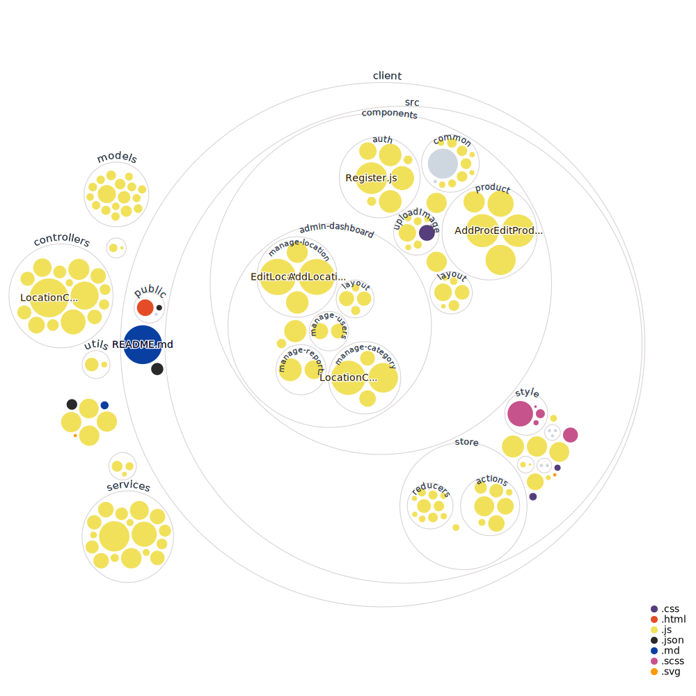

# Introduction
ph-be is Backend for Pet-shop which is Mobile application written by React Native.
Include web dashboard written Reactjs

Pet Home is tiny social network for people who love pet. You can
- Sharing post about your pet
- Find any service relate your pet ( seach by location )
- Match pet like tinder, pet's owner can chat with each other if mathched.
- User have own shop can create and manage product in shop .

# Back-end
Use Nodejs and Expressjs
Main feature:
- Authentication
- Authorization
- Create and manage Post
- Create and manage Product
- Search pet service around
# Codebase

